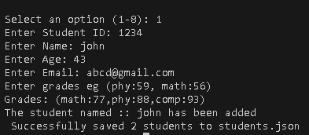
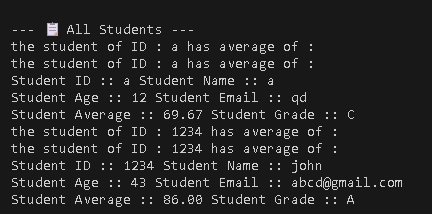

# Student Management System
**Developed by:** Rana Dedar Hussain

---

## 📝 Description
A robust Command Line Interface (CLI) application designed to manage student records efficiently. This system allows for full CRUD operations, persistent data storage using JSON, and automated academic performance analytics including class averages and pass rates.

## ✨ Features
* **Persistent Storage:** Automatically saves and loads student data from `students.json`.
* **Student CRUD:** Add, Search, Update, and Remove student profiles.
* **Academic Analytics:** Calculate individual averages and overall class statistics (Highest/Lowest scores).
* **Smart Input Handling:** Robust parsing of dictionary-style grade inputs (handles symbols like `{}:,`).
* **Version Controlled:** Developed using a feature-branch workflow in Git.

## 📂 Project Structure
```plaintext
Student_Management_System/
├── main.py                # Entry point & CLI Menu logic
├── student.py             # Student Class (Data Model)
├── student_manager.py     # Business Logic & CRUD operations
├── file_handler.py        # Data Persistence (JSON read/write)
└── students.json          # Database (Auto-generated)

🚀 How to Run
Follow these steps to get the project running locally:

Clone the Repository

Bash
git clone https://github.com/RanaDedar/Student_Management_System.git
Navigate to the Directory

Bash
cd Student_Management_System
Run the Application

Bash
python main.py
🛠 Git Workflow Used
This project followed a professional branch-per-feature strategy:

main: The stable production-ready code.

feature/student-class: Implementation of the base Student object.

feature/student-manager: Developed the logic for managing the student list.

feature/file-persistence: Integrated JSON saving/loading capabilities.

feature/cli-menu: Designed the interactive terminal interface.

feature/statistics: Added advanced sorting and grade calculation logic.

📸 Screenshots
1. Adding a Student
Example: Inputting phy:85, math:90 and seeing the "Successfully saved" message.


2. Viewing All Students
Example: Displaying the formatted table of IDs, Names, and Calculated Grades.


👤 Author
Name: Rana Dedar Hussain

Batch: 3

Academy: A² Skills Academy